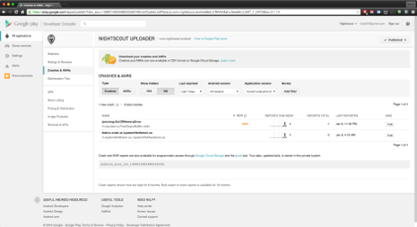
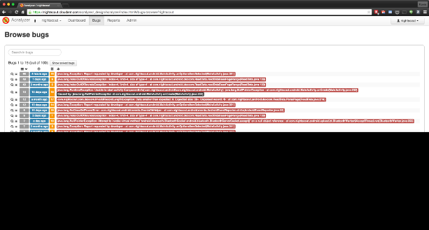

Crash reporting
===============

Application Crash Report for Android also known as ACRA is an open
source crash reporting system for Android. It provides a mechanism for
the team working on the android uploader to collect and analyze
crashes or unexpected behavior in the application. It also provides an
avenue for users to manually report bugs they encounter in their daily
use. The user can disable this reporting in the configuration, it is
enabled by default.

On average, we receive about 10-15 reports per day. Majority (~30%) of
the reports are manually generated by the user.

Currently, only the core team that works on the uploader has access to
Acralyzer.

ACRA introduction
-----------------
[Application Crash Report for Android also known as ACRA](https://github.com/ACRA/acra)  is an open source crash reporting system for Android. It provides a mechanism for the team working on the android uploader to collect and analyze crashes or unexpected behavior in the application. It also provides an avenue for users to manually report bugs they encounter in their daily use. The user can disable this reporting in the configuration, it is enabled by default.

On average, we receive about 10-15 reports per day. Majority (~30%) of the reports are manually generated by the user.

Currently, only the core team that works on the uploader has access to Acralyzer.

Acralyzer
---------
ACRA can be used with a variety of frontends. We currently use the [Acralyzer](https://github.com/ACRA/acralyzer) frontend for reporting. You can search and sort the bug reports.

Bug reports can triggered by 3 mechanisms:

* User requested via the feedback button
* Application crash
* Unexpected events in the uploader that the uploader thinks it can recover from

Dashboards
++++++++++

The Acralyzer dashboard allows us to quickly see hotspots in the code. The dashboard allows us to see spikes in reports at a glance, as well as a breakdown of reports by version.

Information reported by ACRA
____________________________

- Android Package/Application name
- Code Version
- Application version name
- Uptime at the time of the crash
- When the crash occurred
- When the crash was reported
- A uniquely generated ID for the device reporting the crash
- Email address - if the user provided it
- Stack track of the crash
- Timezone associated with the uploader at the time of the crash
- Android version
- Available memory on the device
- Detailed hardware information related to the phone and build of android
- Configuration/State of android at the time of the crash. Example: Hidden keyboard, density dpi, orientation, etc
- Detailed hardware capabilities as reported by the device - Example: bluetooth/bluetooth_le enabled, accelerometer, cdma/gsm/wifi, camera
- Display details and state e.g. width, height, or refresh rate
- Environment details related to storage - mount points, whether or not the storage is encrypted
- Last 250 lines of the logcat - in most current versions of Android, you only have visibility to your app.
- Phone model
- Global settings - Wifi state, wifi sleep policy, backup enabled, etc
- Secure settings - Android ID, lockpattern enabled, screen saver state, etc
- System settings - Default alert sound, volume of all the different channels, hearing aid connected, haptic feedback state, etc
- All preferences associated with Nightscout. We explicitly exclude password information.
- HTTP Headers associated with the report submission as well as the client IP of the submitted report

Ongoing
_______

Future considerations of crash reporting in Nightscout
ACRA's future is [uncertain](https://plus.google.com/118444843928759726538/posts/B5BGjieGVUA). Alternatives like [Splunk's MintExpress](https://mint.splunk.com/) or [HockeyApp](http://hockeyapp.net/features/) offer analogous services that meet or exceed our current needs.

Google play console
+++++++++++++++++++
Applications obtained via Google play have a built in mechanism to report "Crash and Application Not Responding (or ANRs)" back to he development team. Data obtained via Google play console is a small subset of the data offered by ACRA. The play console offers statistics around how many users are affected, what devices are affected, and the versions of android affected. Beyond that it really only offers a stack track and user comments.

In the last 6 months, we have only had 4 reports via the play console. 3 of the 4 reports can be attributed to the chart and only affected android 4.3 devices. The other reported crash was due to an out of memory condition with the mongo driver.

2015-01
=======
At the time of writing this document, there are roughly 1300
installations originating from the Google Play Store.

.. note::

   https://gist.github.com/ktind/eb2af782753f5d14fdcc

