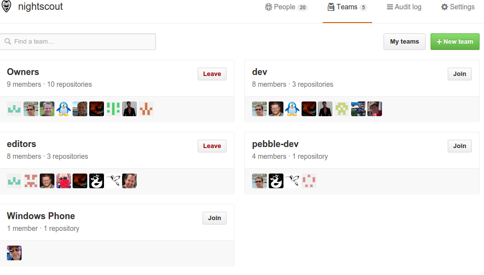

.. _using_github:

Github
======

Github is a social network built around how git, versioning control
software, works.  The source code and development mostly happens using
git.  The github social media site allows developers to co-ordinate
changes using git, using established ssh keys, and other secure
credentials to govern who has write access to the source code.

Teams
+++++
There are teams in the github organization.  These teams govern who
has commit, or write access, to the documentation and source code.

Discussion and documentation
++++++++++++++++++++++++++++

Github allows discussions on per line number, commit, pull request, or
issue basis.  Combined with other use of social media, these materials
allow constant iteration on design, and implementation.

One way to visualize the data that drives the github process is
through the waffle.io viewer
https://waffle.io/nightscout/nightscout.github.io

Anyone with a github account can participate, in discussion, creating
or commenting on issues, or pull requests.

Issues
++++++
Issues have a lableling system that allow them to track feature
requests, bug reports, as well as design discussions.

Pull requests
+++++++++++++
Pull requests allow for review, verification, testing, and discussion
of source code as it is prepared for adoption.

Continuous Testing
++++++++++++++++++
Projects that are using github can arrange to have Travis run tests on
every commit.  The results of the tests are seen in pull requests.

Analysis
++++++++
Some services such as https://codeclimate.com/github/bewest/sgvdata
offer free analysis of source code for linting and common errors.

Some services such as coveralls
https://coveralls.io/r/bewest/sgvdata offers free code coverage
analysis, to visualize which parts of the code have been exercised by
the tests.
https://codecov.io/github/nightscout/android-uploader?ref=dev

Releases
++++++++
Issuing git tag for the master branch at the time of release for the
new version creates a release page on github's site.  These can be
used to track progress of releases, which are tracked both by git hash
and by semantic version number.

