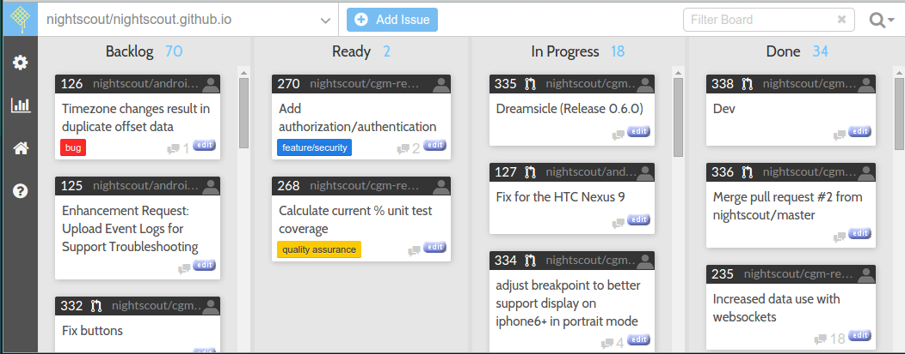

.. toctree::
   :maxdepth: 4

   nexus-timing-change

Case studies
============

These resources help illuminate how the process has played out over
time.

* https://github.com/nightscout/android-uploader/issues/123 - used
  acra info to solve bug

  * PR https://github.com/nightscout/android-uploader/pull/127

* https://github.com/nightscout/android-uploader/pull/93 for bar
  code/qr code

* Dreamsicle release:  https://github.com/nightscout/cgm-remote-monitor/pull/335

* design controls even during review:  https://github.com/nightscout/cgm-remote-monitor/pull/329

* updating documentation https://github.com/nightscout/cgm-remote-monitor/pull/331

*  high level overview:
   https://waffle.io/nightscout/nightscout.github.io

.. image:: https://graphs.waffle.io/nightscout/nightscout.github.io/throughput.svg
 :target: https://waffle.io/nightscout/nightscout.github.io/metrics 
 :alt: 'Throughput Graph'
