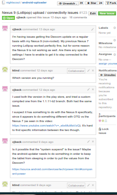

Nexus timing change
===================

The mobile ecosystem provides a heterogenous environment.
Occasionally updates to the behavior with new models requires changing
source code.  In this example, Acra crash analytics were used to
detect a change in managing timing of the polling behavior.  The issue
reported on github as issue 123
https://github.com/nightscout/android-uploader/issues/123 used
acra info to find the required information needed to solve the bug.

The information was used to test patches, which are still under
review, preparing for a release, pull request
https://github.com/nightscout/android-uploader/pull/127 127.

In this case, the issue has 16 comments over a 13 day period.  These
interactions include confirming the issue, finding and reproducing
tests, and confirming fixes while moving it to the next stage in the
process.  After being merged into the dev branch of android-uploader,
a release branch will include the patch into master, along with
updates to the Google play store.

